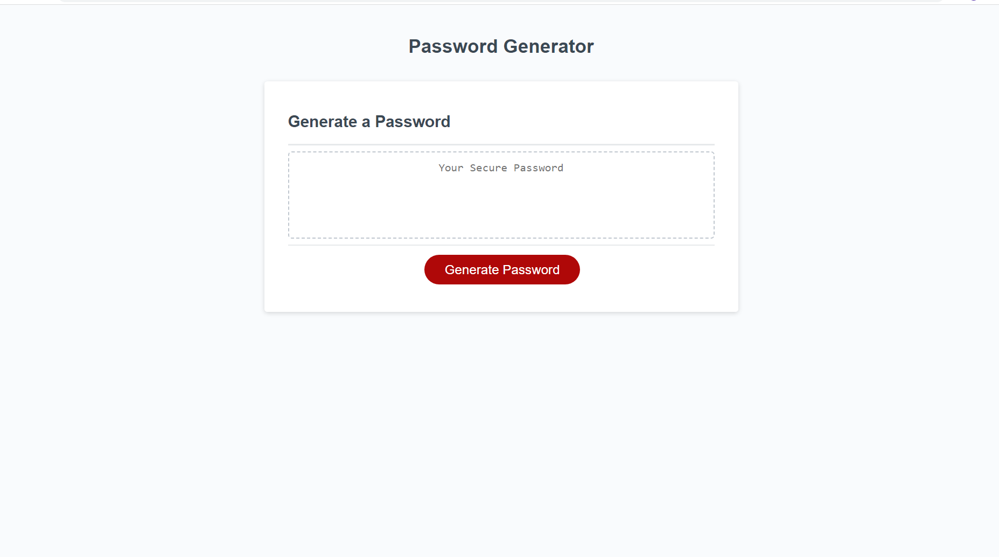

# Marketing Branding Tool 

## Author

Devin Nunez

Email: devv-nunn@gmail.com
git: https://github.com/devv-nunn

## Description

In this project we will generate a random password with a length of the users choice. There are character criterias that can be added to the generated password such as lowercase, upppercase, numerical values, and/or special characters. 

We were given start up code that included the html and the css and as a developer I had to add the javascript to add functionality.

In this project Ive learned the prompt() and the alert() functions along with other javascript topics such as arrays, conditional statements and queryselectors.

## Table of Contents (Optional)

N/a

## Installation

- Nothing needed be installed other than vs code to run application.

- Clone the following repository and run index.html.

## Usage

To use this web page select generate password.

After selecting button application will ask for desired length.

A few more prompts will ask if you want to include other types of characters.
After answering all prompts with proper inputs, generator will then display generated pass word that user could then copy/paste.

## Deployment

Repo: https://github.com/devv-nunn/Random-Number-Generator

GitPage: https://devv-nunn.github.io/Random-Number-Generator/

# Tech Stack

HTML
CSS
JavaScript

## Credits

N/a

## License

MIT License.